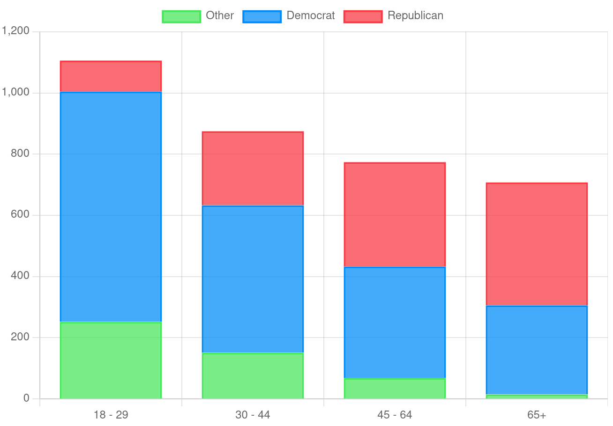
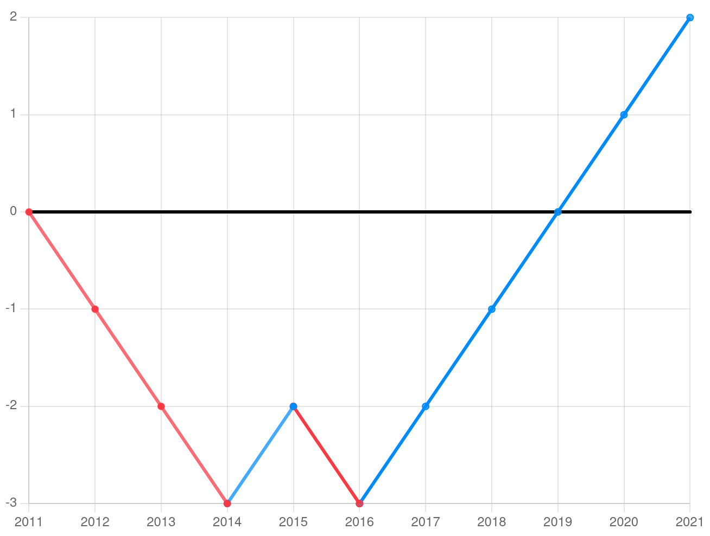

# Final Lab - Very Irate Prawns

## Voter Analysis

This portion of our final lab will cover the ways in which we will make queries on the voterbase to get analyses and conclusions on their voting patterns. From data like this, we could extrapolate trends based on certain demographics, as well as consider the extent to which the votes cast were influenced by outside factors. Larger-scale pictures of the voting trends such as this will allow us to extract information about which parts are the most vulnerable to influence from outside voter manipulation. 


## Assuming this Setup

There are a few assumptions that these examples make about model schemas already being written, result sets already queried, as well as a few helper functions being defined:

```javascript
// various imports / constants
import Mongoose from "mongoose";
import { candidateModel, partyModel, voteModel, voterModel } 
  from "./models/models.js";

const candidates = candidateModel.find();
const parties = partyModel.find();
const votes = voteModel.find().sort('-date');
const voters = voterModel.find();

const demographics = [[18,29], [30,44], [45,64], [65,undefined]];
const states = ['Alabama','Alaska','...'];

// gets a date a certain number of years before now 
//  - if years is undefined, returns the date 150 years before now
const getDateYearsBeforeNow = (years) => {
  let current = new Date();  
  current.setFullYear(current.getFullYear() - (years !== undefined ? years : 150));
  return current;
};

// Gets the party of the most recent vote for a voter
const getVoterPartyFromMostRecentVote = (voter) => 
  getPartyFromCandidate(getCandidateFromVote(getMostRecentVoteFromVoter(voter)));

const addToArrayIfNotIncluded = (item, array) => !array.includes(item) && [...array, item];

// Gets the most recent vote for a given voter
const getMostRecentVoteFromVoter = (voter) => 
  voter === undefined ? undefined :
  votes.find(vote => vote.voter_id === voter.id);

// Gets the candidate from a given vote
const getCandidateFromVote = (vote) =>
  vote === undefined ? undefined :
  candidates.find(candidate => candidate.id === vote.candidate_id);

// Gets the party from a given candidate's ticket
const getPartyFromCandidate = (candidate) =>
  candidate === undefined ? undefined : 
  parties.find(party => party.name === candidate.party_name);

// Gets the party from a given vote
const getPartyFromVote = (vote) => getPartyFromCandidate(getCandidateFromVote(vote));

// Gets a tally of democrat, republican, and other party votes for a collection of Voters
const getPartyCount = (voterbase) => {
  let partyCount = { "democrat": 0, "republican": 0, "other": 0 };
        
  voterbase.forEach(voter => {
    let voteParty = getVoterPartyFromMostRecentVote(voter);
    
    if (voteParty !== undefined) {
      let partyIndex = voteParty.toLowerCase();
      partyIndex = Object.keys(partyCount).includes(partyIndex) ? partyIndex : "other";
      partyCount[partyIndex]++;
    }
  });

  return partyCount;
};
```

Most of these hellper functions aren't too exciting and simply exist to navigate between models - for instance, we can use `vote.candidate_id` to match a vote to a candidate by iterating through the `candidates` set until we find one where `candidate.id` matches `vote.candidate_id`.

One function of note is `getPartyCount`, which, when given a collection of voters, will return a JSON object that stores the vote tally for each party, like so:

```json
// Result of getPartyCount
{
  "democrat": 6,
  "republican": 3,
  "other": 1
}
```
With these assumptions in place, we can continue to the implementation of our analysis queries.

## Query Users by Age

First up is a query that deals with the age demographic ranges that we defined. It will iterate through that array, using the sub-arrays containing low and high age bounds to look at votes cast by members of the voterbase within the given age range. 

```javascript
// gets an array of party representation by voter age
const getPartyRepresentationByAge = () => {
  const results = [];
  
  demographics.forEach(([ low, high ]) => {
    voterModel.find({ 
      age: { 
        $gte: getDateYearsBeforeNow(low), 
        $lte: getDateYearsBeforeNow(high) 
      }})
      .then(queryResult => getPartyCount(queryResult))
      .then(partyCount => results.push({
        ages: [low, high],
        voteCount: partyCount 
      }));
  });

  return results;
};
```
The data is returned in the following format:

```json
[
  {
    "ages": [18, 29],
    "voteCount": {
      "democrat": 7,
      "republican": 1,
      "other": 2
    }
  },
  {
    "ages": [30, 44],
    "voteCount": {
      "democrat": 5,
      "republican": 4,
      "other": 1
    }
  },
  // Array continues with all age ranges...
]
```
With the `voteCount` property of each JSON object, we can view the total party breakdown by age range. We can also construct certain visual representations from this result set, such as a stacked bar graph displaying the portion of each demographic group that voted for a given party:



While not the most useful for voter influence, this data will offer us insight into which age groups might be the most vulnerable to manipulation.

## Query Users by State and Age

With some slight modification to the above approach, we can also isolate the voters by both state and age. This will allow us to see a more granular snapshot of where certain age ranges are voting for whom.

```javascript
// gets an array of party representation on a per state and age basis
const getPartyRepresentationByAgeAndState = () => {
  const results = [];

  demographics.forEach(([ low, high ]) => {
    let resultObject = {
      ages: [low, high],
      states: [],
    };

    states.forEach(state => {
      voterModel.find({ 
          age: { 
            $gte: getDateYearsBeforeNow(low), 
            $lte: getDateYearsBeforeNow(high) },
          state: state 
        })
        .then(queryResult => getPartyCount(queryResult))
        .then(partyCount => resultObject.states.push({
          state: state,
          voteCount: partyCount
        }));
    });

    results.push(resultObject);
  });

  return results;
};

```
Data is returned in the following form: 

```json
[
  {
    "ages": [18, 29],
    "states": [
      {
        "state": "Alabama",
        "voteCount": {
          "democrat": 1,
          "republican": 2,
          "other": 0
        }
      },
      {
        "state": "Alaska",
        "votecount": {
          "democrat": 1,
          "republican": 1,
          "other": 1
        }
      },
      // Array continues with objects for each state...
    ]
  },  // ...and more demographic ranges.
]
```

This could be used with various US maps to show previews of how the electoral college votes for a given election would fall were the 

## Query to Return Votxes from Users who have voted for more than one Party

A more interesting query would be to try to find the voters who could potentially on the fence. Within both parties, there tend to be diehard voters who will vote for the party regardless - these voters are of little interest to us when we're looking for the voters who would be susceptible to manipulation.

In order to find the multi-party voters, we can look through all of the votes that we have for a given voter, adding the party of the candidate from each vote to a `Set` of party names. After we've seen every vote, if the `Set.size > 1`, we know that our voter has voted for more than one party. 

```javascript
// gets an array of all users who have voted for more than one party 
//  as well as their vote history
const getMultiPartyVoterTrends = () => {
  const results = [];

  voters.forEach(voter => {
    const allVotes = [];
    const partiesVoted = new Set();
    
    votes.forEach(vote => vote.voter_id === voter.id && allVotes.push(vote));
    allVotes.forEach(vote => partiesVoted.add(getPartyFromVote(vote)));

    if (partiesVoted.size > 1) {
      const allVotesWithParty = [];
      [...allVotes].reverse().forEach(vote => {
        allVotesWithParty.push({
          ...vote,
          party: getPartyFromVote(vote)
        });
      });

      results.push({
        voter: voter,
        votes: allVotesWithParty
      });
    }

  return results;
};
```

Once we've identified multi-party voters, we add an object containing their `Voter` object as well as an array of all of their `Vote`s. This is the form the data will be returned in:

```json
[
  {
    "voter": {
      "id": { "$oid" : "622fe039fc13ae46440002ab" },
      "first_name": "Marlee",
      "last_name":"Jozefowicz",
      // ...
    },
    "votes": [
      {
        "id": 123,
        "candidate_id": 321,
        "date": "01/02/20",
        //...
        "party": "republican"
      },
      {
        "id": 456,
        "candidate_id": 654,
        "date": "01/03/21",
        // ...
        "party": "democrat"
      }
    ]
  }, 
  // ...
]
```
During the process of adding the `Vote`s to the object, we inverted the order so that they are now sorted in ascending date order. This means that if we were to iterate through the list of votes, we would get a picture of how their voting trends look over time.

For this example, we're going to only consider the Democrat and Republican parties. By putting both parties as opposite directions on the Y-Axis of a line graph, we can get a party vote differential by moving the datapoints cumulatively in the direction of the party that the vote was cast for:



There are a number of conclusions that can be drawn from this graph. Using the magnitude of the distance from the X-Axis in either direction, we can determine the intensity (or lack thereof) of a voter's party loyalty. Similarly, close proximity to the X-Axis would indicate a moderate voter who hasn't demonstrated a strong preference for either party.

Another feature to take note of are the moments where the slope inverts. This would indicate that the person has voted towards the direction of the other party, potentially indicating a changed mind or a moment of influence. Consistent trends in the opposite direction could show that a voter has been influenced by some factor to change their views on a given topic.

These insights can be used in tandem with the Social Media Analysis portion of our voting system to try to pinpoint events or actors that were responsible for the change in voter opinion.


## Further Insight: True Moderate Voters

As an extra insight into our voters, we can build off of the previous query to get a collection of "true moderate" voters, which we will arbitrarily define as any voter who hasn't voted for one party more than 60% of the time. 

Using the result set from the previous `getMultiPartyVoterTrends` query, we can identify all of the voters that fit this moderate definition. This set could be used to identify voters who are susceptible to future manipulation.

```javascript
// gets all moderate voters - voters who have between 40-60% votes for each party
const getModerateVoters = () => {
  const multiPartyVoters = getMultiPartyVotingTrends();
  const moderates = [];

  multiPartyVoters.forEach(voter => {
    const voteParties = { "democrat": 0, "republican": 0 };

    voter.votes.forEach(vote => {
      let party = getPartyFromVote(vote).toLowerCase();
      Object.keys(voteParties).includes(party) && voteParties[party]++;
    });

    let { democrat, republican } = voteParties;
    let totalVotes = democrat + republican;
    let democratPercent = democrat / totalVotes;

    democratPercent >= .4 && democratPercent < .6 && moderates.push(voter);
  });

  return moderates;
}
```